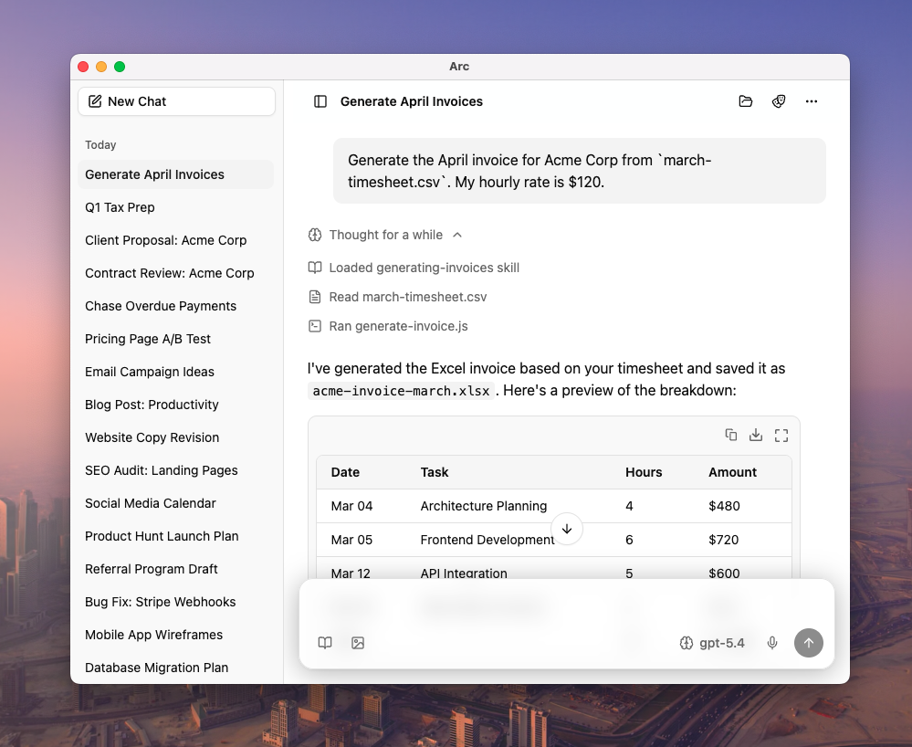

# Arc


[](https://github.com/hccheung117/arc/releases)
[](https://github.com/hccheung117/arc/releases)

An agentic desktop AI chat client for macOS and Windows. Bring your own providers, models, and workflow.



## The Problem with AI Clients

Most AI apps force non-technical users to juggle API keys, model names, base URLs, and complex system prompts. Setting up a team or trying to share a specific workflow is a nightmare.

**Arc works differently.** 

We assume users just want to chat, and experts want to configure. In Arc, all configuration is bundled into a portable **Profile** file. An expert (or power user) builds the profile. Normal users just import the profile into the app and start working—zero setup required.

Perfect for:
- **Teams & Enterprises:** Distribute a company-wide profile with custom productivity skills and your internal API gateway keys.
- **AI Providers:** Create a seamless onboarding experience for your users (e.g., OpenRouter can distribute a pre-configured profile).
- **Power Users:** Keep all your prompts, local model configs, and automations in a single, version-controllable folder.

---

## Feature Highlights

- **Local Agentic Capabilities:** The AI has real agency to read/write local files, run scripts, and automate your browser within a single conversation loop.
- **Session Workspaces:** Every conversation automatically gets its own isolated file directory for safely managing AI-created artifacts.
- **Progressive Skills:** Extend AI expertise with zero-dependency markdown skills that load dynamically only when relevant, preventing system prompt bloat.
- **First-Class Prompt Engineering:** Iterate on system prompts per-session, use AI to refine them, and promote the best ones into a curated library of reusable templates.
- **Advanced Chat Management:** Treat conversations like living documents by organizing with folders and pins, or branching and forking threads to explore alternative paths.
- **Multi-Window Parallel Work:** Detach any session into its own window to run multiple AI tasks side-by-side.
- **Power-User Composer:** Write comfortably with an auto-growing editor featuring a unique drag-to-resize height lock.
- **Portable Profiles:** Bundle your providers, models, prompts, and skills into a single file to instantly switch contexts or share setups with your team.

---

## Quick Start (For End Users)

If someone sent you a `.arc` file, you can get started in seconds.

1. **Download Arc:** Get the latest release for your OS from the [Releases page](https://github.com/hccheung117/arc/releases).
2. **Install & Open:** Launch Arc on your desktop.
3. **Import Profile:** Import your `.arc` file into the app. Start chatting immediately.

---

## Building Profiles (For Distributors & Power Users)

A Profile is just a directory containing markdown and JSON files. No hidden UI settings, no rigid databases. Just pure, version-controllable text.

When you distribute a profile, you bundle:
- **Providers:** Your API keys and custom endpoints.
- **Models:** Default and favorite models for different tasks.
- **Prompts:** Pre-written system instructions.
- **Skills:** Zero-dependency automations written in Markdown.

[Detailed profile documentation → docs/core-providers.md](docs/core-providers.md)

---

## Architecture & Design Philosophy

### Profiles are distributable

Most AI tools tie configuration directly to the app. API keys, model preferences, and custom prompts live in settings menus that every user has to fill out themselves. Arc takes a different approach by putting all of this into a **profile**: a portable directory that bundles providers, models, prompts, and skills together.

An expert can set up a profile once, and everyone else just imports it and starts chatting. There are no setup screens and no credential juggling. You can swap profiles to instantly switch between completely different AI configurations — one for your team, another for personal use, or one shared by a community.

### Skills without a dev environment

Agent skills in most tools inherently assume you're running them on a developer's machine with specific runtimes installed. Arc takes a different approach: skills themselves are simply markdown files with frontmatter, allowing them to be loaded with zero dependencies. 

When a skill does need to execute code, it leverages environments that are shipped with the OS or Arc itself. It can use Node.js (via the underlying Electron app for true cross-platform scripts), or Bash and PowerShell for OS-specific native capabilities. For the user, it remains a truly dependency-free experience—no dev environment required.

These skills load on demand through tool calls rather than being packed into the system prompt upfront. This keeps the system prompt small and stable, ensuring that provider-side prompt caching actually remains effective across turns.

### Prompts have a lifecycle

Most tools force you to write complex system prompts upfront before you even start chatting—the so-called "agent" approach. But this is unnatural. The best patterns and instructions usually only become clear *during* iteration. 

Arc implements a one-way flow that matches how people actually work. A prompt starts as a one-off experiment typed into a single conversation. As you refine it and find what works, you promote it to your personal collection. If it's worth sharing, you distribute it through a profile. You discover the prompt as you go, rather than guessing it at the start.

### Settings resolve in layers

Shareable configuration and personal preferences inevitably conflict. If you edit a shared profile to add your own preferences, you break it for others. Arc solves this by treating profiles as a baseline. 

A personal per-user config directory (the `@app` layer) overrides, extends, or cancels profile settings without ever touching the profile itself. Different settings use different merge strategies: model favorites can be added or canceled, task assignments (like which model handles title generation or transcription) can be nulled out, and prompts or skills resolve by name with the personal layer winning. The profile stays clean; your customization stays personal.

### Predictable, cross-platform runtime

Arc is built on Electron (which bundles Node.js), enabling stable, predictable cross-platform skills via Node-based scripts. This architecture paves the way for future plugins that can hook into and customize Arc's behavior to provide rich, deeply integrated features. By leveraging a mature ecosystem—Electron alongside the AI SDK, AI elements, shadcn, and TipTap—Arc achieves the best return on investment with a highly capable, low-effort development foundation.

---

## Development

Want to contribute to the source code?

```bash
# Clone the repository
git clone https://github.com/hccheung117/arc.git
cd arc

# Install dependencies
npm install

# Start the dev server
npm start
```

## Built With

Electron, React, Vercel AI SDK, TipTap, Tailwind, Zustand.
